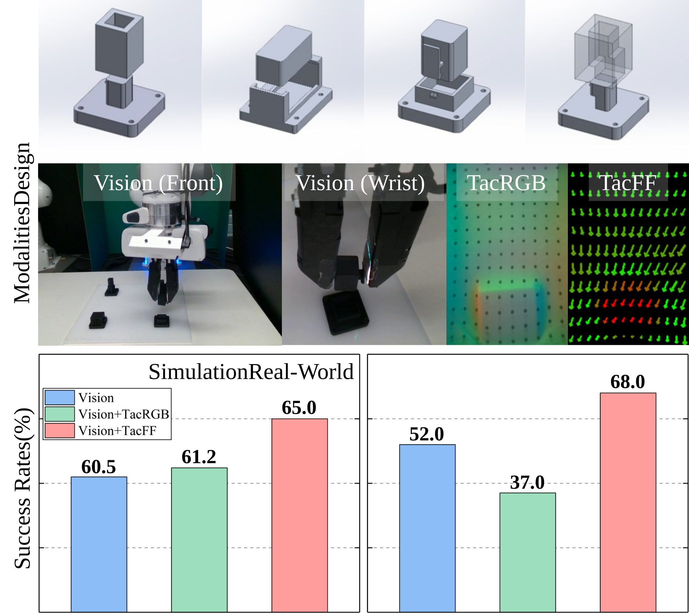

<div align="center">

<h2>CONTACT:<br>
CONtact-aware TACTile Learning for Robotic Disassembly</h2>

<a href="https://vict0rhu.github.io/CONTACT-Website/"></a>
<a href="https://arxiv.org/abs/2603.08560"></a>
<a href="https://drive.google.com/drive/folders/1FqhPtE4S8JfbGgZU9uFjm-rjhGslpqEy"></a>

</div>

<p align="center">
<a href="https://www.linkedin.com/in/yosuke-saka-446410283">Yosuke Saka</a>*,
<a href="https://vict0rhu.github.io">Jyun-Chi Hu</a>*,
<a href="https://www.linkedin.com/in/adeeshdesai/">Adeesh Desai</a>*,
<a href="https://zhangzhiyuanzhang.github.io/personal_website/">Zhiyuan Zhang</a>*,
<br>
<a href="https://www.linkedin.com/in/bihao-zhang-861754352/">Bihao Zhang</a>,
<a href="https://quan-luu.github.io/">Quan Khanh Luu</a>,
<a href="https://prince-css.github.io/#">Md Rakibul Islam Prince</a>,
<a href="https://zh.engr.tamu.edu/">Minghui Zheng</a>,
<a href="https://www.purduemars.com/">Yu She</a>
<br>
* Equal Contribution
</p>

<p style="width: 80%; margin: 0 auto; text-align: justify;">
<strong>CONTACT</strong> is a simulation benchmark for investigating the role of
tactile sensing in robotic disassembly. It provides five rigid-body disassembly
tasks with progressively increasing geometric constraints and contact complexity,
implemented in IsaacGym with TacSL-based tactile rendering. Policies are trained
with Diffusion Policy using multimodal visuotactile observations.
</p>

<p align="center">

</p>

## Highlights

- **Five disassembly tasks**: `loose_plug`, `tight_plug`, `lidded_loose`,
  `barbed_flat`, `barbed_spike`, ordered by contact complexity.
- **Three sensing modalities per task**: `vision` (camera only),
  `vistac` (vision + tactile RGB), `visff` (vision + tactile force field).
- Ready-to-run script for every task and modality.

## Installation

```bash
git clone https://github.com/AdeeshDesai/CONTACT.git
cd CONTACT
bash install.sh
conda activate contact
```

The installation script creates the `contact` conda environment and sets up
the dependencies under `thirdparty/`: IsaacGym TacSL (downloaded
automatically), the TacSL simulation environments, and Diffusion Policy. If
the automatic IsaacGym download fails, grab it manually from
[here](https://drive.google.com/file/d/13dFRF9EXpzIWaJF2Z6f7BsuPUGQkPE8v/view?usp=sharing),
place the tar.gz in `thirdparty/`, and rerun `install.sh`.

## Dataset

```bash
bash scripts/download_data.sh barbed_flat     # one task
bash scripts/download_data.sh all             # all five tasks
```

Manual alternative: download the zip for your task from the
[dataset folder](https://drive.google.com/drive/folders/1FqhPtE4S8JfbGgZU9uFjm-rjhGslpqEy?usp=sharing)
and unzip it inside `CONTACT/data/`.

## Training

Ready-to-run scripts for every task and modality:

```text
training/<task>/<modality>.sh
```

```bash
bash training/barbed_flat/vision.sh       # vision only
bash training/barbed_flat/vistac.sh       # vision + tactile RGB
bash training/barbed_flat/visff.sh        # vision + tactile force field
```

Each script takes an optional seed and Hydra overrides:
`bash training/barbed_flat/visff.sh 43 training.num_epochs=500`.

To sweep across all tasks:

```bash
bash scripts/run_all.sh visff             # one modality, all five tasks
bash scripts/run_all.sh all 42            # all modalities, all tasks
```

Success rate and rollout videos are evaluated periodically during training.

## Evaluation

```bash
python eval.py \
    -c data/outputs/vision_barbed_flat_50/42/checkpoints/latest.ckpt \
    -o data/outputs/vision_barbed_flat_50/42/eval_output \
    -n train_diffusion_workspace_disassembly.yaml \
    -d cuda:0
```

## Logging

Training logs to [Weights & Biases](https://wandb.ai) by default (run
`wandb login` once, or set `WANDB_MODE=offline` to run without an account).
The W&B project name is set per task (`dp_<task>`, override with
`logging.project=...`).

## Repository structure

```
CONTACT/
├── training/                 # ready-to-run: training/<task>/<modality>.sh
├── train.py / eval.py        # entrypoints
├── contact/                  # configs, dataset, env runners, policies, workspace
├── isaacgymenvs/ tacsl/      # TacSL task and environment definitions
├── assets/                   # task meshes and URDFs
├── scripts/                  # run_all.sh sweeps, dataset download
├── thirdparty/               # simulator + policy stack land here at install
└── install.sh
```

## Citation

```bibtex
@article{saka2026contact,
  title={CONTACT: CONtact-aware TACTile Learning for Robotic Disassembly},
  author={Saka, Yosuke and Hu, Jyun-Chi and Desai, Adeesh and Zhang, Zhiyuan and Zhang, Bihao and Luu, Quan Khanh and Prince, Md Rakibul Islam and Zheng, Minghui and She, Yu},
  journal={arXiv preprint arXiv:2603.08560},
  year={2026}
}
```

## Acknowledgments

CONTACT builds on [ManiFeel](https://github.com/purdue-mars/manifeel),
[TacSL](https://iakinola23.github.io/tacsl/), and
[Diffusion Policy](https://github.com/real-stanford/diffusion_policy).

## License

This repository is released under the [MIT License](LICENSE).
